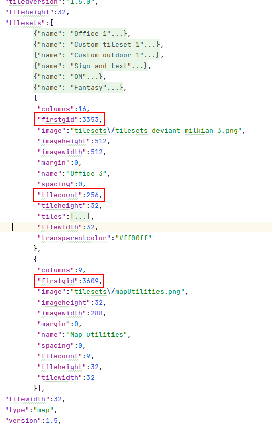

# Development

Building map tutorial at [https://workadventu.re/map-building](https://workadventu.re/map-building).

## Guidelines

To create a new map, make a dedicated folder for your map with the used tile sets.

It allows you to customize existing tile sets while avoiding any potential side
effects on other maps.

Only sounds may be placed in the common folder.

### Starter kit

You can use the starter map by copy/pasting it if you want.

### Tile sets

In Tiled (the software used to create/edit maps), it may be hard to import an image
as a tile set.

But you can bypass the software limitation by editing the map's JSON file.

* edit the JSON file of a map already using an image you also want to use
* in the `tilesets` section copy the tile set you are interested in
* paste this tile set at the end of the `tilesets` section of your map's JSON file
* then you need to edit the `firstgid` attribute of your tile set by adding the
  `firstgid` and the `tilecount` attributes from the previous tile set of your map (see screenshot below)

Then do not forget to copy/paste the tile set image into your map folder and to
update the path in the JSON.

You can then re-open your map in Tiled and your new tile set should be detected.

## Fonts

Some texts on images use the font family "Pixeled" from https://www.dafont.com/pixeled.font.
